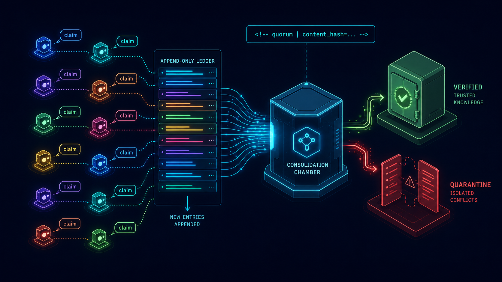

# quorum



Knowledge consolidation MCP server for [Claude Code](https://claude.ai/code). Observes claims from a swarm of subagents, clusters them via a pluggable similarity engine, promotes the agreed-upon ones to verified status, quarantines contradictions, and serves the consolidated result back with cache-bust headers that structurally prevent context poisoning.

Append-only ledger. Off-hot-path consolidation. Pluggable similarity. Loud failures. MIT-licensed.

---

## Why

Long-running agent swarms re-discover the same facts over and over, contradict each other, and silently retain stale knowledge through KV cache reuse. Existing memory MCPs treat read and write as a single flow, which means a bad write (an LLM hallucination written into memory) immediately poisons future recall.

Quorum separates three concerns:

1. **Write** — `learn_shout` appends one observation to a JSONL ledger. Lock-free, atomic, no LLM in the loop.
2. **Consolidate** — runs off the hot path (cron / `loop` skill / dashboard button). Clusters new observations via a configurable similarity engine. Promotes claims that ≥2 distinct agents have asserted to **verified**. Demotes contradicted claims into a **quarantine** pair for human resolution. Recomputes content hashes.
3. **Recall** — serves the consolidated result back as markdown with a mandatory header `<!-- quorum | domain=X | content_hash=Y | recall_ts=Z -->` on line 1. When the consolidated store changes, the header changes — and KV cache misses on every reader that depended on the old state. Cache-bust is structural, not advisory.

TTL decay, evidence provenance, and the contradict→quarantine flow are the three other anti-poisoning primitives.

---

## Similarity engines

Eight engines ship; the dashboard surfaces each one's battle-test status:

| Engine | Status | Notes |
|---|---|---|
| `hash-only` | battle-tested | Exact-match + Jaccard normalization. No API key required. |
| `claude-haiku` | battle-tested | **Default.** Uses [@anthropic-ai/claude-agent-sdk](https://www.npmjs.com/package/@anthropic-ai/claude-agent-sdk)'s `query()` — auth flows through your Claude Code session's OAuth token. No separate API key needed. |
| `claude-sonnet` | untested | Same Agent SDK path, larger model. |
| `openai-embed` | untested | `text-embedding-3-small` cosine clustering. Requires `OPENAI_API_KEY`. |
| `gemini` | untested | `embedding-001`. Requires `GEMINI_API_KEY`. |
| `deepseek` / `minimax` / `local-minilm` | stub — contribute | Coded shell; implementations welcome. |

The `untested` engines work end-to-end but haven't been exercised under real swarm load yet. Each graduates to `battle-tested` by surviving a dedicated battle-test pass (see `tests/battle-test/`).

---

## Install

```bash
git clone https://github.com/Antheurus/quorum-mcp.git ~/.claude/mcp-servers/quorum
cd ~/.claude/mcp-servers/quorum
bun install
bun bin/quorum.ts init
```

`init` creates `config.json`, sets up storage directories, and optionally registers the MCP server in `~/.claude/settings.json`.

The default engine is `claude-haiku`. It uses your Claude Code session's OAuth — no separate `ANTHROPIC_API_KEY` is required.

Restart Claude Code after `init` so the MCP registration takes effect.

---

## Claude Code registration

`quorum init` handles this interactively. To add manually:

```json
{
  "mcpServers": {
    "quorum": {
      "command": "bun",
      "args": ["/Users/<you>/.claude/mcp-servers/quorum/src/index.ts"]
    }
  }
}
```

Replace `<you>` with your macOS username. Restart Claude Code after editing.

After restart, `/mcp` should list `quorum` with 6 tools: `learn_shout`, `learn_recall`, `learn_consolidate`, `learn_contradict`, `learn_verify`, `learn_status`.

---

## Dashboard

```bash
bun bin/quorum.ts dashboard
```

Then open <http://127.0.0.1:4729>.

The dashboard shows per-domain ledger stats, consolidated knowledge, quarantine pairs, the engine catalog with battle-test tags, and lets you trigger consolidation or change settings.

---

## Periodic consolidation

Add a crontab entry:

```cron
*/15 * * * * cd ~/.claude/mcp-servers/quorum && bun bin/quorum.ts consolidate
```

Or use the `loop` skill inside Claude Code:

```
/loop 15m quorum consolidate
```

Consolidation is the only LLM-touching path. Write and recall don't call any model.

---

## Backup

The `data/` directory is **not** tracked by git. It lives at `~/.claude/mcp-servers/quorum/data/`. To preserve it across reinstalls:

```bash
mv ~/.claude/mcp-servers/quorum/data ~/quorum-data-backup
ln -s ~/quorum-data-backup ~/.claude/mcp-servers/quorum/data
```

---

## CLI reference

```
quorum init              Initialize config and register MCP server
quorum consolidate       Consolidate all domains
quorum consolidate <d>   Consolidate a specific domain
quorum status            Print per-domain counts + last consolidation time
quorum dashboard         Start HTTP dashboard (http://127.0.0.1:4729)
quorum --help            Show help
```

---

## Troubleshooting

**Config not found** — Run `bun bin/quorum.ts init`.

**Port conflict** — Edit `config.json:dashboard.port` to a free port.

**Claude binary not found**

```
{"level":"fatal","msg":"claude binary not found — install Claude Code CLI or switch engine to hash-only"}
```

The default engine `claude-haiku` uses Claude Code's OAuth session. If this error appears, ensure the `claude` CLI is installed and on your `PATH`, or change `config.json:similarity.engine` to `hash-only`.

**API key invalid** — For `openai-embed`, `gemini`, `deepseek`, `minimax`: update the key via the Settings page at <http://127.0.0.1:4729>, or edit `config.json:similarity.api_keys` directly.

---

## Architecture

The repo's `docs/plan/` directory contains the master plans the orchestration was built against — including the recent claude-first refactor and battle-test pass. Both plans are reproducible references for the design decisions.

Inspired by [claude-mem](https://github.com/thedotmack/claude-mem)'s worker-runtime auth pattern (Agent SDK + Claude Code OAuth) but solves a different problem: claude-mem captures session transcripts; quorum consolidates structured claims from a swarm.

---

## License

MIT — see [LICENSE](LICENSE).
