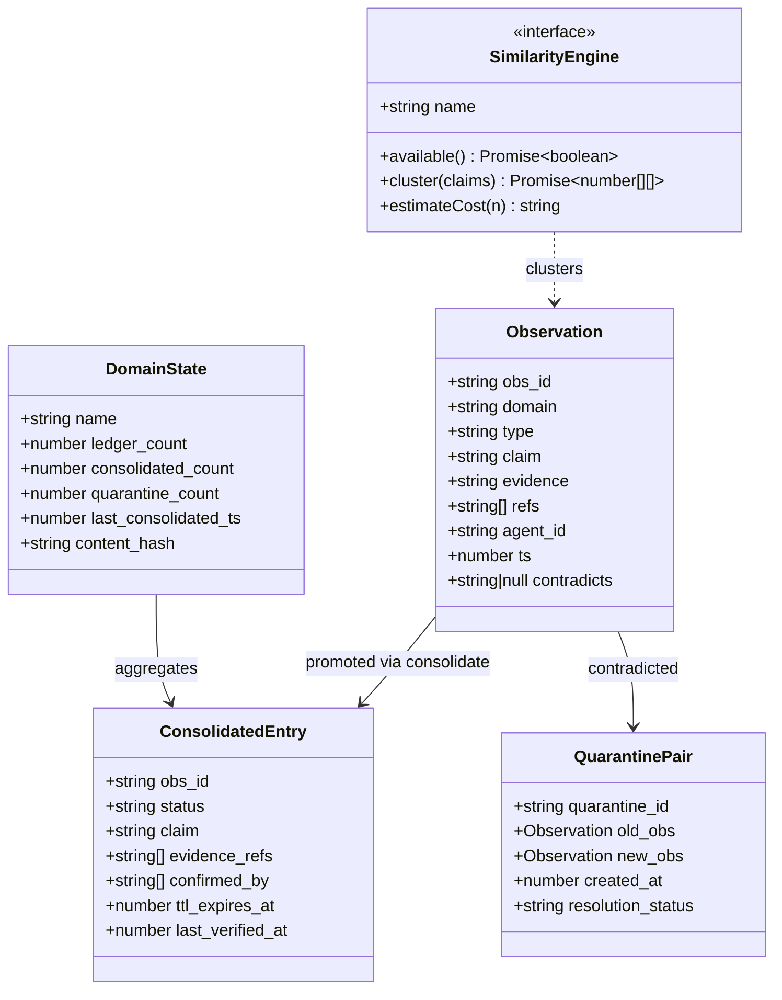
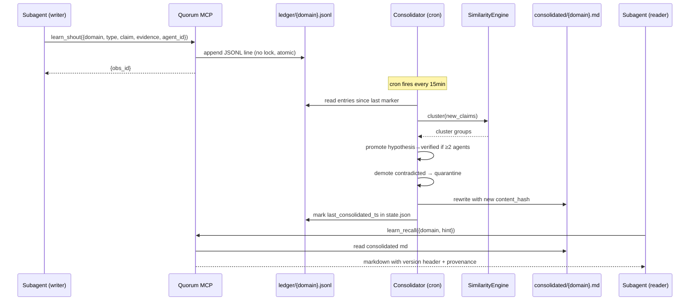
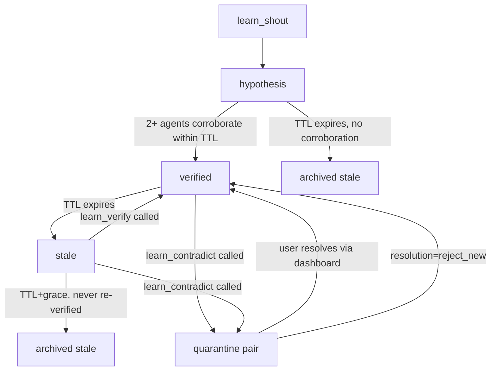

## TLDR — North Star

> Build `quorum` — an MCP at `~/.claude/mcp-servers/quorum/` that lets 40+ swarm subagents shout observations into an append-only ledger, runs a deterministic consolidator off-hot-path (with pluggable similarity engine: hash-only / claude-haiku / openai-embed / gemini / deepseek / minimax / local), and serves consolidated lessons back via `learn_recall` with TTL + provenance + cache-bust headers that structurally prevent context poisoning. Includes a localhost HTTP dashboard for inspection + config. **No phase ships until its predecessor's success criteria pass — Phase 6 (frontend) cannot land before Phase 5 (HTTP backend); Phase 4 (MCP entry) cannot wire tools that Phase 3 hasn't built.**

## Open Questions

_(All resolved 2026-05-25 — answers below; assumptions verified.)_

### Resolved
- **Auto-consolidation trigger** → **strictly cron-only**. No auto-trigger on shout. `auto_trigger_threshold` removed from config v0.1 to avoid race surface. Cron/loop skill is the only invocation path.
- **`quorum init` and settings.json** → **interactive prompt during init**. CLI asks `Add quorum to ~/.claude/settings.json? [y/N]` — on `y`, backup to `settings.json.bak` first, then add `mcpServers.quorum` entry. On `N`, print snippet for user to paste manually.
- **Storage location** → **`~/.claude/mcp-servers/quorum/data/`**. Co-located with MCP code. User pref over recommendation. Note: backup/reinstall must preserve `data/` directory explicitly.
- **Dashboard auth** → deferred (YAGNI). Binds to 127.0.0.1 only. Document SSH port-forward in README for remote dev cases.

### Assumptions (verified)
- User has Bun installed (verified — used throughout edlink project).
- MCP SDK 1.0.4+ stable for our tool registry pattern (verified via package metadata).
- Hono on Bun runtime works natively (verified in Hono docs).
- Alpine.js v3 from CDN acceptable for dashboard interactivity (~15KB, no build step).

## Executive Summary

Quorum is a self-learning memory MCP designed for users who run massive agent swarms. It separates three concerns that existing solutions conflate: (1) **write path** is lock-free append to JSONL, (2) **consolidation** is deterministic + cheap-similarity, runs off hot path, and (3) **read path** serves pre-merged markdown with mandatory provenance and cache-bust headers. Anti-poisoning is structural — TTL decay, contradiction quarantine, and version-headered recall prevent stale facts from silently persisting via KV cache. Ships with HTTP dashboard for inspection + centralized config across all settings (engine choice, API keys, TTL overrides).

## 5W+1H

- **What** — MCP server (stdio) + HTTP dashboard at `~/.claude/mcp-servers/quorum/`. 6 MCP tools, 4 functional similarity engines + stubs, single-page vanilla-JS dashboard.
- **Why** — User value: swarm subagents stop re-discovering the same facts; verified knowledge accumulates without poisoning. Technical value: KV cache no longer adversarial — cache-bust headers force fresh recall when canonical state changes.
- **Who** — Primary user: power user running 6–12 main + 40 subagents. Affected systems: Claude Code MCP runtime, project-local `.learn/` doesn't exist (storage is global at `~/.claude/mcp-servers/quorum/data/`).
- **When** — Done when: MCP responds to `tools/list`, all 6 tools return schema-valid responses, consolidator processes a ledger of 10+ entries deterministically, dashboard loads and shows seeded domain. See research §Out of scope for non-goals.
- **Where** — `~/.claude/mcp-servers/quorum/{src,bin,docs}` for code; `~/.claude/mcp-servers/quorum/data/{ledger,consolidated,quarantine,archive,state.json}` for data; `~/.claude/mcp-servers/quorum/config.json` for centralized config.
- **How** — Bun runtime + TypeScript no-build, `@modelcontextprotocol/sdk` for stdio MCP, Hono for HTTP, Alpine.js from CDN for dashboard. File-based storage with `fs.appendFile` (atomic on POSIX for small writes).

## Diagrams

### Class diagram — core types

### Sequence diagram — full lifecycle

### Flowchart — claim status state machine

## File inventory

### Files to create

**Foundation layer:**
- `package.json` — deps (mcp-sdk, hono, zod) + bun scripts
- `tsconfig.json` — TS config, no build step
- `src/types.ts` — Observation, ConsolidatedEntry, QuarantinePair, DomainState, SimilarityEngine types
- `src/config.ts` — load/save `~/.claude/mcp-servers/quorum/config.json` with defaults + zod validation
- `src/paths.ts` — resolve storage_dir, ensure subdirs exist, atomic file helpers

**Storage layer:**
- `src/storage/ledger.ts` — append-only JSONL writer + tail reader since marker
- `src/storage/consolidated.ts` — read/write consolidated markdown per domain + content_hash compute
- `src/storage/quarantine.ts` — quarantine pair store, resolution writer
- `src/storage/archive.ts` — move processed ledger entries to monthly archive files
- `src/storage/state.ts` — per-domain DomainState read/write (last_consolidated_ts, hashes)

**Similarity engine layer:**
- `src/similarity/engine.ts` — SimilarityEngine interface + registry + dropdown enum
- `src/similarity/hash-only.ts` — exact hash + Jaccard normalized substring, no API
- `src/similarity/claude.ts` — Anthropic SDK adapter (haiku + sonnet model variants)
- `src/similarity/openai.ts` — text-embedding-3-small cosine cluster
- `src/similarity/gemini.ts` — gemini-1.5-flash or embedding-001
- `src/similarity/stubs.ts` — deepseek + minimax + local-minilm stubs (throw helpful error)

**Lifecycle layer:**
- `src/lifecycle/ttl.ts` — per-type TTL defaults, expiry compute, decay detection
- `src/lifecycle/promote.ts` — hypothesis→verified rules, demote→quarantine rules

**MCP tool layer:**
- `src/tools/shout.ts` — append observation, no LLM
- `src/tools/recall.ts` — filtered markdown read with version header
- `src/tools/consolidate.ts` — run consolidator pipeline for a domain
- `src/tools/contradict.ts` — quarantine an obs by id, store new contradicting obs
- `src/tools/verify.ts` — reset TTL for an obs by id
- `src/tools/status.ts` — per-domain counts + last consolidation timestamp

**Entry points:**
- `src/index.ts` — MCP server stdio entry, wires all tools to @modelcontextprotocol/sdk
- `src/server.ts` — Hono HTTP dashboard server with JSON API + static HTML serving
- `bin/quorum.ts` — CLI (init / consolidate / status / dashboard / verify-config)

**Frontend:**
- `src/dashboard/index.html` — single-page shell with tabs (Overview / Domain / Settings)
- `src/dashboard/app.js` — vanilla JS + Alpine.js (CDN) for reactivity
- `src/dashboard/style.css` — minimal CSS, dark theme

**Docs:**
- `README.md` — install, register to Claude Code, dashboard usage, config reference
- `config.example.json` — sample config with comments

### Files to modify

None — entirely greenfield.

### Files to NOT touch

- `~/.claude/settings.json` — only print snippet for user to paste; never auto-edit (per Open Questions resolution).
- Any file outside `~/.claude/mcp-servers/quorum/` — project is self-contained.

## Phase breakdown

### Phase 1: Foundation — config + types + storage primitives

**Goal:** Project boots; `bun src/index.ts` starts MCP server that responds to `tools/list` with empty list; `quorum init` creates config.json and storage directories.

**Files:**
- Create: `package.json`, `tsconfig.json`, `src/types.ts`, `src/config.ts`, `src/paths.ts`, `bin/quorum.ts` (init subcommand only), `config.example.json`

**Dependencies:**
- Requires: nothing
- Provides: Type vocabulary, config loader, path helpers for all later phases

**Separation of concerns:**
- Handles: Types, config loading/validation, path resolution, directory creation
- Does NOT handle: storage I/O, similarity logic, MCP tools, HTTP server

**Success criteria:**
- [ ] `bun install` succeeds (no peer dep warnings)
- [ ] `bun bin/quorum.ts init` creates `~/.claude/mcp-servers/quorum/data/{ledger,consolidated,quarantine,archive}/` and `~/.claude/mcp-servers/quorum/config.json` with default contents
- [ ] `bun bin/quorum.ts init` is idempotent (second run = no error, doesn't overwrite existing config)
- [ ] `bun bin/quorum.ts init` interactively prompts `Add quorum to ~/.claude/settings.json? [y/N]` — on `y` writes backup to `settings.json.bak` then adds `mcpServers.quorum` entry; on `N` prints the snippet for manual paste
- [ ] `bun src/index.ts` exits cleanly (no MCP wiring yet, just config load proof)
- [ ] Config validation rejects invalid TTL values (e.g., negative)

**Context:**
- See research doc §"Config file layout" for JSON shape and defaults
- Bun's `Bun.file().json()` for reads, `Bun.write()` for atomic writes
- zod for config schema validation

**Concerns:**
- `~` expansion — Bun doesn't expand `~` in paths; use `import { homedir } from "os"` and `path.join`

---

### Phase 2: Storage layer — ledger, consolidated, quarantine, archive, state

**Goal:** All file I/O primitives work atomically; manual write-then-read tests pass; state.json round-trips correctly.

**Files:**
- Create: `src/storage/ledger.ts`, `src/storage/consolidated.ts`, `src/storage/quarantine.ts`, `src/storage/archive.ts`, `src/storage/state.ts`

**Dependencies:**
- Requires: Phase 1 (types, paths)
- Provides: All persistence ops for tools and consolidator

**Separation of concerns:**
- Handles: File reads, atomic appends, content hashing (sha256 of consolidated md), monthly archive rolling
- Does NOT handle: business logic (promote/demote rules live in lifecycle), similarity, networking

**Success criteria:**
- [ ] `appendObservation(domain, obs)` appends one JSON line; concurrent appends from 5 spawned processes preserve all entries
- [ ] `readLedgerSince(domain, marker)` returns only entries with `ts > marker`
- [ ] `writeConsolidated(domain, entries)` produces markdown with stable `content_hash`; identical input → identical hash
- [ ] `quarantine.add(pair)` and `quarantine.list(domain)` round-trip correctly
- [ ] `archive.roll(domain, beforeTs)` moves entries to `archive/{domain}-{yyyy-mm}.jsonl` and removes from ledger
- [ ] `state.read(domain)` returns sane defaults if file missing; `state.write` is atomic (write-temp-then-rename)

**Context:**
- See research doc §"Data flow" for storage semantics
- Use Bun's native `fs.appendFile` (atomic for writes < PIPE_BUF on POSIX)
- Hash computed via Bun's `Bun.hash()` for speed; if cross-runtime needed later, switch to `crypto.subtle`

**Concerns:**
- Concurrent appends > PIPE_BUF (4KB on macOS) can interleave bytes → corruption. Mitigation: keep each observation JSON under 2KB by trimming `evidence` to 800 chars max in shout, store overflow in separate evidence file referenced by path.

---

### Phase 3: Similarity engine layer — interface + 4 working impls + stubs

**Goal:** Each engine.available()/cluster() works independently; dropdown registry enumerates all 8 options correctly.

**Files:**
- Create: `src/similarity/engine.ts` (interface + registry), `src/similarity/hash-only.ts`, `src/similarity/claude.ts`, `src/similarity/openai.ts`, `src/similarity/gemini.ts`, `src/similarity/stubs.ts` (deepseek/minimax/local-minilm with helpful errors)

**Dependencies:**
- Requires: Phase 1 (config for API keys + engine choice)
- Provides: `getEngine(name)` factory for consolidator

**Separation of concerns:**
- Handles: Claim clustering only — given list of claims, return groups of indices
- Does NOT handle: promotion logic (that's lifecycle), persistence (that's storage), MCP tool wiring

**Success criteria:**
- [ ] `hash-only.cluster(["foo bar", "foo bar", "baz qux"])` returns `[[0,1], [2]]`
- [ ] `claude.cluster(...)` makes Anthropic API call using haiku-4-5 model from config, parses response into index groups (uses prompt caching for system prompt to reduce cost on repeated calls)
- [ ] `openai.cluster(...)` embeds claims via text-embedding-3-small, groups by cosine > 0.85
- [ ] `gemini.cluster(...)` uses embedding-001 with same threshold
- [ ] All 4 working engines pass same fixture test (10 claims, 3 expected clusters)
- [ ] Stub engines throw `Error("Engine X not yet implemented — contribute via {url}")` with engine name in message
- [ ] `engine.available()` returns false (not throws) when API key missing — dashboard uses this to gray out dropdown options

**Context:**
- See research doc §"Similarity engine interface"
- Claude adapter: use prompt caching on the system instruction ("You group claims by topic similarity...") to slash repeated cost
- Engines fetched fresh each consolidator run — no long-lived clients (keeps memory low when MCP idle)

**Concerns:**
- Each engine has slightly different rate limit profile. Add 200ms delay between Claude API calls (haiku limit: 50 req/min on free tier).

---

### Phase 4: Lifecycle layer — TTL + promotion rules

**Goal:** Deterministic functions that take a set of observations + their counterparts and decide status transitions; pure functions, no I/O.

**Files:**
- Create: `src/lifecycle/ttl.ts`, `src/lifecycle/promote.ts`

**Dependencies:**
- Requires: Phase 1 (types, config for TTL defaults)
- Provides: Pure decision functions for consolidator

**Separation of concerns:**
- Handles: "Given these observations + these existing consolidated entries, here's the new set of entries + quarantine pairs to write"
- Does NOT handle: clustering (similarity engine does that), persistence, networking

**Success criteria:**
- [ ] `computeTtlExpiry(type, ts, configOverrides)` returns correct timestamp
- [ ] `isExpired(entry, now)` returns true when ts > expiry
- [ ] `promote(cluster, existing)` returns `verified` status when ≥2 distinct agent_ids
- [ ] `promote(cluster, existing)` returns `hypothesis` when 1 agent_id only
- [ ] `demote(obs, contradictingObs)` returns QuarantinePair with both observations + resolution_status="pending"
- [ ] Tests cover edge cases: 2 shouts from same agent (still hypothesis), expired verified entry being re-shouted (resets TTL)

**Context:**
- See research doc §"Promotion rules" + §"TTL defaults"
- Pure functions — easy to unit test, no mocks needed

**Concerns:**
- "Same agent_id" detection: agent_id format like `main-1`, `sub-12`. Define `agent_id` as opaque string; equal-string check is enough.

---

### Phase 5: MCP tools — 6 tools wired with zod schemas

**Goal:** Each tool callable in isolation; given mock storage, returns expected shape.

**Files:**
- Create: `src/tools/shout.ts`, `src/tools/recall.ts`, `src/tools/consolidate.ts`, `src/tools/contradict.ts`, `src/tools/verify.ts`, `src/tools/status.ts`

**Dependencies:**
- Requires: Phases 2 (storage), 3 (similarity), 4 (lifecycle)
- Provides: Tool implementations for MCP server entry to register

**Separation of concerns:**
- Handles: MCP request → orchestrate storage + lifecycle + similarity calls → MCP response
- Does NOT handle: stdio transport (Phase 6), HTTP routing (Phase 7)

**Success criteria:**
- [ ] `shout(input)` validates input with zod, appends to ledger, returns `{obs_id}` in < 50ms
- [ ] `recall(input)` reads consolidated md, prepends version header `<!-- quorum | domain=X | content_hash=Y | recall_ts=Z -->`, optionally filters by hint substring, respects max_tokens cap
- [ ] `consolidate(input)` runs full pipeline: read since marker → cluster via engine → apply lifecycle → write consolidated → roll archive → update state. Returns `{merged, promoted, archived, quarantined}` counts
- [ ] `contradict(input)` looks up obs by id, creates QuarantinePair with new contradicting obs, removes old from active consolidated
- [ ] `verify(input)` updates `last_verified_at` and recomputes TTL expiry for given obs_id
- [ ] `status(input)` returns DomainState[] for all domains or single domain
- [ ] All 6 tools have JSON schema discoverable via MCP `tools/list`

**Context:**
- See research doc §"MCP tool surface" table
- Each tool file exports `{name, schema, handler}` triple — uniform shape
- Use zod's `.describe()` so JSON schema includes human descriptions for `tools/list`

**Concerns:**
- `recall` markdown can exceed max_tokens easily. Use a heuristic chunker: split by `##` headers, score chunks by hint relevance (substring count), keep top-N until budget filled. Document the heuristic in tool description.

---

### Phase 6: MCP server entry (stdio)

**Goal:** `bun src/index.ts` exposes all 6 tools over stdio MCP protocol; Claude Code can connect and `tools/list` returns 6 entries.

**Files:**
- Create: `src/index.ts`

**Dependencies:**
- Requires: Phase 5 (all tools implemented)
- Provides: Working MCP server that Claude Code can register

**Separation of concerns:**
- Handles: Wire @modelcontextprotocol/sdk Server, register tools, handle stdio transport, log to stderr (never stdout — corrupts MCP frame)
- Does NOT handle: HTTP, dashboard, business logic

**Success criteria:**
- [ ] `bun src/index.ts` starts and waits on stdin
- [ ] Test harness sends `tools/list` JSON-RPC → response has 6 tools with names matching specs
- [ ] Test harness sends `tools/call` with `name="learn_shout"` and valid input → response shape `{content: [{type:"text", text:"{obs_id}..."}]}`
- [ ] All stderr output is structured (no stray console.log to stdout)
- [ ] Registering via `~/.claude/settings.json` `mcpServers` entry and running Claude Code shows tools available

**Context:**
- @modelcontextprotocol/sdk `Server` + `StdioServerTransport`
- Tool handlers wrap our Phase 5 handlers, marshalling input/output through MCP content blocks

**Concerns:**
- Logging to stdout breaks MCP. Set `console.log = console.error.bind(console)` at top of file as safety net.

---

### Phase 7: HTTP dashboard backend (Hono)

**Goal:** `bun src/server.ts` starts HTTP server on port 4729 with JSON API + static HTML serving.

**Files:**
- Create: `src/server.ts`

**Dependencies:**
- Requires: Phases 2, 3, 4, 5 (all logic)
- Provides: HTTP endpoints that frontend (Phase 8) calls

**Separation of concerns:**
- Handles: HTTP routing, JSON serialization, static file serving from `src/dashboard/`
- Does NOT handle: MCP protocol (separate process)

**Success criteria:**
- [ ] `GET /api/domains` → array of DomainState
- [ ] `GET /api/domain/:name/ledger?since=ts&limit=N` → paginated raw observations
- [ ] `GET /api/domain/:name/consolidated` → consolidated markdown
- [ ] `GET /api/domain/:name/quarantine` → quarantine pairs
- [ ] `POST /api/domain/:name/consolidate` → triggers consolidator, streams progress as SSE (optional v0.1: just blocks and returns final counts)
- [ ] `GET /api/config` → current config (API keys MASKED — return only first/last 4 chars)
- [ ] `POST /api/config` → updates config.json (re-validates with zod, rejects invalid)
- [ ] `GET /` → serves `src/dashboard/index.html`
- [ ] `GET /app.js`, `/style.css` → serves static assets
- [ ] Binds to 127.0.0.1 only (refuses 0.0.0.0 / public IPs)

**Context:**
- Hono on Bun: `import { Hono } from "hono"; export default { fetch: app.fetch, port: 4729 }`
- Bun auto-detects `export default { fetch, port }` and starts server

**Concerns:**
- POST /api/config can clobber settings under race. Acceptable for single-user dashboard. Document "only one tab editing settings at a time."

---

### Phase 8: Frontend dashboard (vanilla JS + Alpine.js)

**Goal:** Dashboard loads, shows domains, lets user browse ledger / consolidated / quarantine, edit settings, trigger consolidation.

**Files:**
- Create: `src/dashboard/index.html`, `src/dashboard/app.js`, `src/dashboard/style.css`

**Dependencies:**
- Requires: Phase 7 (HTTP API)
- Provides: User-facing inspection + config interface

**Separation of concerns:**
- Handles: Render lists, dropdowns, forms; fetch from API; submit edits
- Does NOT handle: data validation (server re-validates via zod)

**Success criteria:**
- [ ] Open `http://127.0.0.1:4729/` → page loads, shows domain list (empty state if none)
- [ ] Click a domain → tabs for Ledger / Consolidated / Quarantine render with data
- [ ] Settings tab shows dropdown with all 8 similarity engines; selected one shows API key input (masked) if applicable
- [ ] Save settings → POST /api/config, success toast appears, dropdown reflects new selection
- [ ] "Consolidate Now" button on domain page → POST triggers, shows result counts
- [ ] Quarantine view shows pairs side-by-side, "resolve to A" / "resolve to B" buttons that POST contradiction resolution (deferred from v0.1 if scope tight: just display, no actions)

**Context:**
- See research doc §"Frontend (dashboard) requirements"
- Alpine.js v3 from CDN: ``
- All state in `x-data` blocks, all fetches in `x-init`
- Dark theme baseline, simple two-column layout

**Concerns:**
- CDN dependency = offline dashboard breaks. Acceptable for v0.1; can self-host Alpine in `dashboard/vendor/` later if user requests.

---

### Phase 9: CLI binary completion + README

**Goal:** `quorum` CLI has `init`, `consolidate`, `status`, `dashboard` subcommands; README explains install + Claude Code registration.

**Files:**
- Modify: `bin/quorum.ts` (extend with consolidate/status/dashboard subcommands beyond Phase 1's `init`)
- Create: `README.md`

**Dependencies:**
- Requires: All prior phases
- Provides: User-facing entry points

**Separation of concerns:**
- Handles: Argument parsing (use built-in `process.argv` — no commander needed), call into existing tool handlers, exit codes
- Does NOT handle: any business logic

**Success criteria:**
- [ ] `quorum init` (already in Phase 1)
- [ ] `quorum consolidate [domain]` runs consolidator (all domains if arg omitted), prints counts table
- [ ] `quorum status` prints per-domain counts + last consolidation time as table
- [ ] `quorum dashboard` starts HTTP server in foreground, prints `http://127.0.0.1:4729`
- [ ] `quorum --help` lists subcommands
- [ ] README has: 30-second install path, settings.json snippet, dashboard URL, troubleshooting (config not found, port conflict, API key invalid)

**Context:**
- Use Bun's `Bun.argv` (alias for process.argv)
- Print snippets in code blocks the user can copy

**Concerns:**
- Cron setup for periodic consolidation: README documents `crontab -e` snippet + suggests user's `loop` skill as alternative. v0.1 ships no cron daemon — strictly user-triggered or cron-invoked.

## Cross-phase guidelines

- **All file paths via `src/paths.ts`** — no inline `~/.claude/mcp-servers/quorum/data/...` strings. Single source of truth for storage locations.
- **All zod schemas use `.describe()`** — these flow into MCP `tools/list` for agent discoverability.
- **Logging via `console.error` only** — `console.log` to stdout breaks MCP stdio protocol. Add safety override in `src/index.ts`.
- **Config writes are atomic** — write to tmp then rename. Never partial-write the config file (a 40-agent swarm reading mid-write would crash).
- **No `npm` references in docs** — user uses Bun exclusively. All install/run instructions in README assume `bun`.
- **Errors propagate to user via MCP `content: [{type:"text", text:"ERROR: ..."}]`** — don't crash the MCP process on tool failure.
- **Coding-standard.md applies** — particularly Rule #15 (no comments on self-explanatory code) and Rule #10 (no extra docs files unless requested).

## Progress log

_(empty — populated as phases land)_

## Review findings

_(empty — filled by reviewer after Phase 9)_

## Final status

_(empty — written when orchestration completes)_

---

**Plan confidence: 9/10 | Execution readiness: 9/10 | Risk: medium**

All open questions resolved 2026-05-25:
- Auto-consolidation: strictly cron-only (matches recommendation)
- `quorum init` + settings.json: interactive prompt with backup
- Storage location: co-located at `~/.claude/mcp-servers/quorum/data/`

Plan is ready for execution. Risk stays medium (not low) because it's greenfield code with 4 integration surfaces (MCP stdio, HTTP, file storage, similarity APIs) — recoverable but worth conservative reviews per phase.
